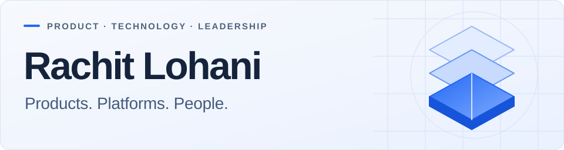

<picture>
  <source media="(prefers-color-scheme: dark)" srcset="assets/profile-dark.svg">
  <source media="(prefers-color-scheme: light)" srcset="assets/profile-light.svg">
  
</picture>

### Product & technology leader. Founder. Builder.

I build software and the teams behind it. My work spans enterprise platforms, applied AI, and the operating decisions that turn an idea into a product people rely on.

Currently building multiple projects across **AI, enterprise software, and logistics**.

**[Website](https://rachitlohani.com/)** &nbsp; / &nbsp; **[Writing](https://rachitlohani.com/insights/)** &nbsp; / &nbsp; **[LinkedIn](https://www.linkedin.com/in/rachitlohani/)**

## Currently building

<table>
  <tr>
    <td width="50%" valign="top">
      <h3>Qubere</h3>
      
<strong>AI for customs & trade operations</strong>

      
Connecting document intelligence, customs workflows, compliance, and customer collaboration so teams can move from information to action.

      
<a href="https://www.qubere.ai/">Explore Qubere ↗</a>

    </td>
    <td width="50%" valign="top">
      <h3>Freight & logistics</h3>
      
<strong>Product exploration</strong>

      
Exploring connected shipper and carrier workflows: routing guides, load execution, exception handling, and the systems that support them.

      
<em>In development.</em>

    </td>
  </tr>
</table>

## Experience I build on

Previous roles across enterprise supply chain, workforce software, developer platforms, and financial software.

| Company | Previous role & scope |
| :--- | :--- |
| **E2open** | **Chief Product & Technology Officer** — product management, engineering, and technology strategy for enterprise supply chain software. |
| **Paylocity** | **Chief Technology Officer** — scaled the technology and product organization to **1,500+ people**, with responsibility spanning product, engineering, design, data, security, and IT. |
| **Atlassian** | **Head of Engineering** — platform capabilities and engineering organization development. |
| **Intuit** | **Director of Engineering** — knowledge engineering and AI initiatives. |
| **CoderBuddy** | **Founder** — developer support platform, acquired by Pluralsight. |

[More about my work and career ↗](https://rachitlohani.com/about/)

## Selected writing

The questions I keep coming back to: how to make AI dependable, how to build useful platforms, and how to help teams do their best work.

- **[The Hard Truth About Evals](https://medium.com/@rlohani/the-hard-truth-about-evals-7c32c9ac5a7c)** — evaluating AI beyond a convincing demo.
- **[8 Months in the RAG Trenches](https://medium.com/@rlohani/8-months-in-the-rag-trenches-the-pragmatic-path-from-prototype-to-production-fc4dd7a2d644)** — lessons from prototype to production.
- **[Paylocity’s Engineering Principles](https://medium.com/paylocityprodtech/paylocitys-engineering-principles-cf261eae5656)** — the principles behind engineering decisions and team execution.

## How I work

**Start with the customer.** Understand the workflow and the decision that needs to get easier.

**Make the system dependable.** Design for evaluation, observability, and the cases where things go wrong.

**Give people clarity.** Connect business intent to engineering decisions, with clear ownership and room to act.

---

Interested in **building products, dependable AI, or engineering organizations**? [Let’s connect.](https://www.linkedin.com/in/rachitlohani/)
